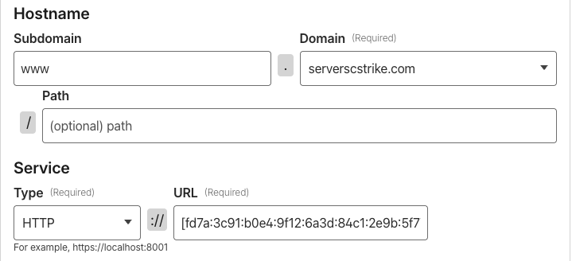

# pterodactyl-cloudflared
Dockerfile and Egg to run Cloudflare Tunnel inside a Pterodactyl server.

This repository provides everything needed to integrate a Cloudflare tunnel (cloudflared) into your Pterodactyl server, allowing you to securely expose services without opening ports directly on your firewall or router.

## Repository contents

- Dockerfile — Image with cloudflared and required scripts.
- entrypoint.sh — Startup script.
- egg-cloudflared.json — Egg to use in Pterodactyl.
- logrotate.d — Log rotation configuration for cloudflared.

## Features

- Cloudflare Tunnel integration directly from a Pterodactyl-managed server.
- Allows exposing services without opening ports.
- Compatible with custom eggs.
- Automatic log rotation.
- Cloudflared version: 2026.1.2.

## Requirements

- Pterodactyl installed.
- Cloudflare account.

## Installation

- Upload `egg-cloudflared.json` to your Pterodactyl panel.
- Upload the file  
  [pterodactyl-cloudflared](https://github.com/Sinaloense/pterodactyl-cloudflared/blob/main/logrotate.d/pterodactyl-cloudflared)  
  to the `/etc/logrotate.d/` directory on your main host.

## Create a Cloudflare tunnel

- https://developers.cloudflare.com/cloudflare-one/networks/connectors/cloudflare-tunnel/get-started/create-remote-tunnel/

## Create a cloudflared server

- When creating your cloudflared server, simply copy your tunnel token and place it in `TOKEN`.
- When creating a route in your Cloudflare tunnel, set the service type to **HTTP** and the URL to **IP:PORT**:
    ```
    If your server was assigned IPv6: [fd7a:3c91:b0e4:9f12:6a3d:84c1:2e9b:5f77]:8001
    If your server was assigned IPv4: 192.168.0.1:8001

    I recommend using local IPs. On your main host, you can create multiple local IPv6 or IPv4 addresses,
    and within Pterodactyl assign a local IP to each user.
    That same user can then assign their HTTP services using the local IP assigned to them,
    only changing the port.
    ```
    

    
    
    
